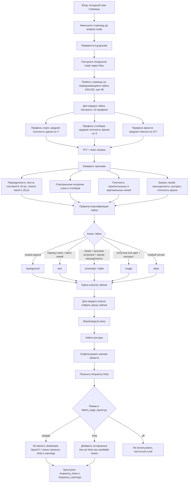

# Частотный Анализ Макета Страницы

Этот документ описывает вспомогательный алгоритм из `scripts/layout_frequency.py`. Он не заменяет основной OpenCV-детектор макета, а дает ему независимый слой подсказок и предупреждений: где страница похожа на текст, схему, таблицу или изображение.

## Блок-Схема

## Как Работает Алгоритм

1. **Подготовка страницы.** Скан уменьшается до рабочего масштаба, обычно с максимальной стороной 1800 px. Это делает частоты сопоставимыми между страницами и ускоряет обработку.

2. **Foreground mask.** Страница переводится в оттенки серого, затем порогом Otsu определяется, что считать краской. Алгоритм проверяет, темная или светлая часть является foreground, чтобы не сломаться на инверсных фрагментах.

3. **Разбиение на тайлы.** Страница режется на перекрывающиеся окна `192x192` px с шагом `96` px. Перекрытие нужно, чтобы блоки, попавшие на границу окна, не исчезали.

4. **Построение одномерных профилей.** Для каждого тайла считаются профили строк и столбцов: сколько краски есть в каждой строке и каждом столбце. Дополнительно считаются такие же профили по средней темноте пикселей.

5. **FFT-анализ профилей.** Из каждого профиля вычитается среднее значение, применяется окно Hann, затем считается `rFFT` и энергия спектра. Для текста особенно важна энергия в диапазоне периодов строк `8..44 px`; для вертикальных структур используется диапазон `4..28 px`.

6. **Дополнительные признаки.** Помимо частот считаются спектральная энтропия, плотность горизонтальных и вертикальных линий, баланс линий, насыщенность цвета, контраст и плотность краски. Это важно, потому что схемы тоже содержат подписи и дают текстоподобную периодичность.

7. **Классификация тайла.** Правила сначала отсекают фон, затем сильный текст, изображения и line-art. Схемы определяются не просто по периодичности, а по сочетанию линий, высокой энтропии, низкой насыщенности и умеренной плотности краски.

8. **Сборка подсказок.** Тайлы одного класса превращаются в бинарную маску, маска слегка замыкается морфологически, после чего по контурам получаются прямоугольные `frequency hints`.

9. **Использование в основном детекторе.** В режиме `validate` подсказки не меняют OpenCV-разметку, а только записываются в `layout.json` и создают предупреждения о несовпадениях. В режиме `hints` частотный слой может осторожно добавить line-art области как дополнительные candidate boxes.

## Калибровка

Константы были подобраны по исходным сканам уже проверенных страниц, а не по PNG-превью с цветными рамками. Скрипт `scripts/calibrate_layout_frequency.py` измеряет признаки тайлов внутри проверенных блоков, строит диапазоны `p05 / median / p95` и confusion matrix.

Текущий отчет:

- `study/layout_frequency_calibration.md`
- `study/layout_frequency_calibration.json`

По последней калибровке использовано 15 страниц и 2920 тайлов. Для текста измеренный диапазон доминирующего периода строк `p05..p95` составил примерно `19.2..38.4 px`, поэтому рабочий диапазон `8..44 px` оставлен с запасом.

## Ограничения

- Частотный слой хорошо видит регулярность, но не понимает смысл содержимого.
- Схемы с большим количеством подписей могут быть похожи на текст, поэтому окончательное решение лучше принимать вместе с OpenCV-признаками.
- Фотографии с очень контрастными прямыми линиями иногда похожи на схемы; для этого используется насыщенность и полутоновая энтропия, но полностью проблему это не убирает.
- Частотные подсказки полезнее как контроль и hint layer, чем как единственный источник разметки.
