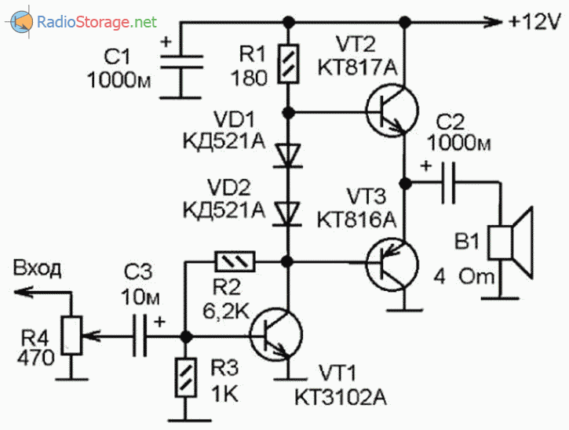
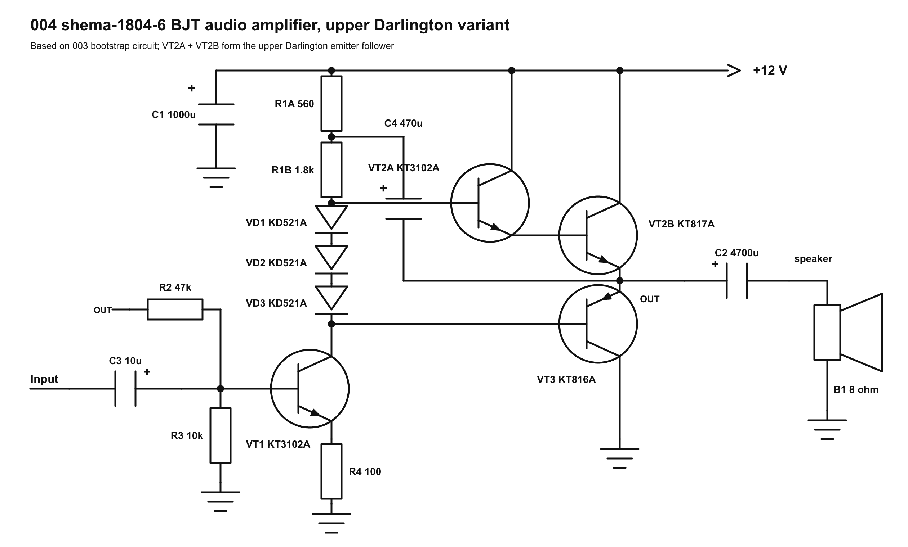
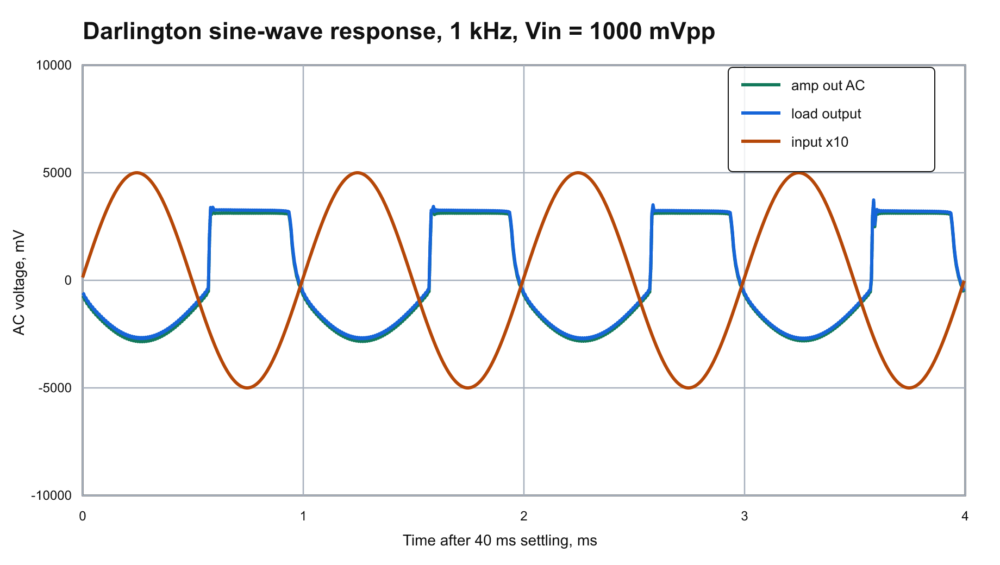
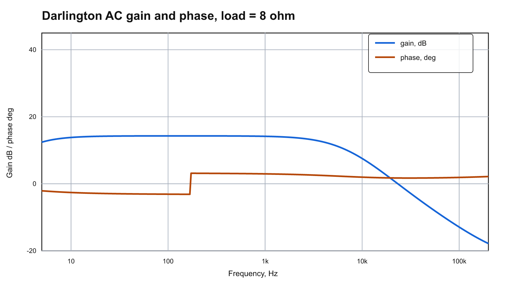
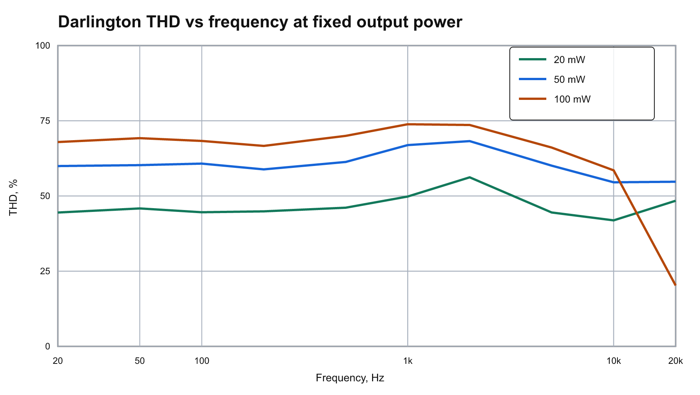
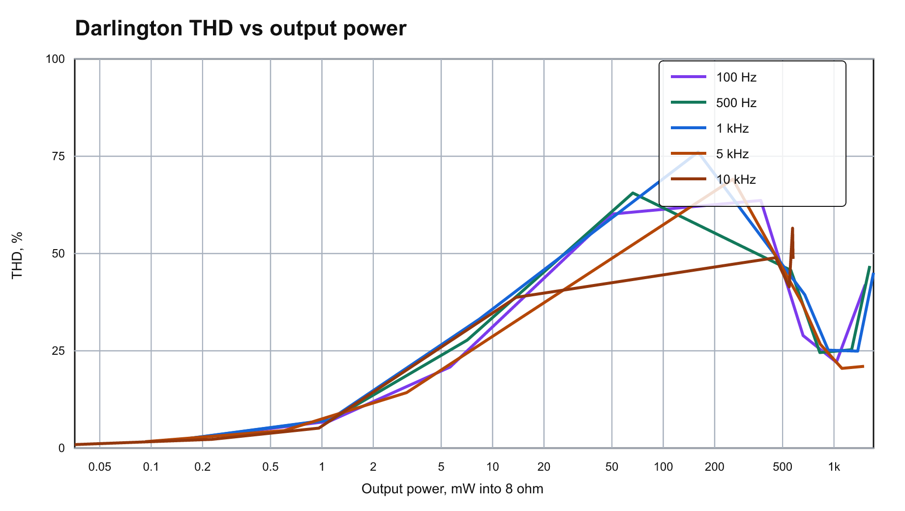
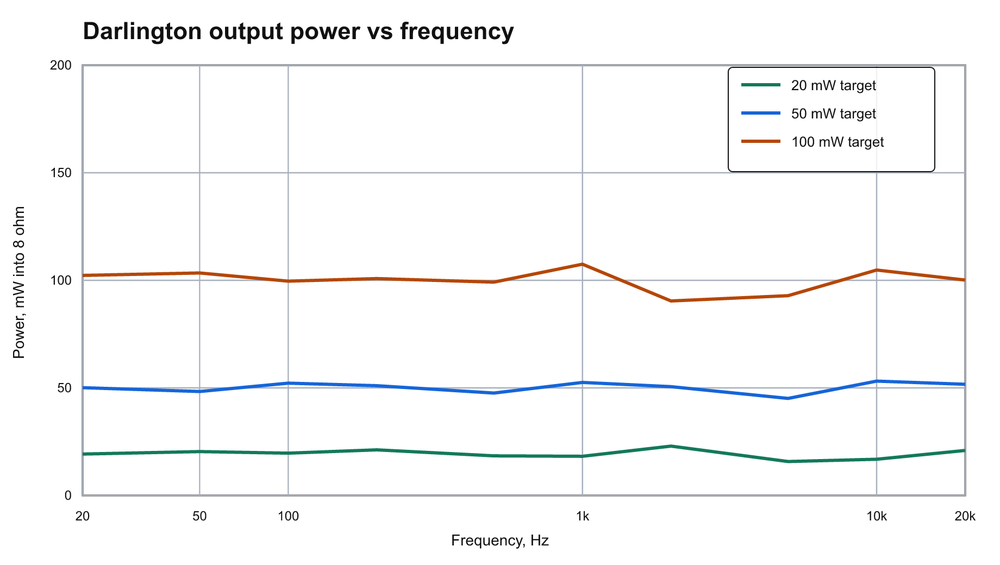
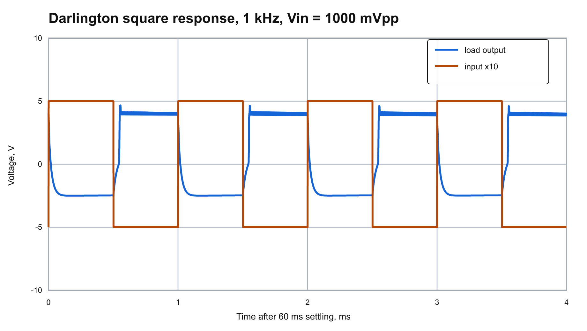
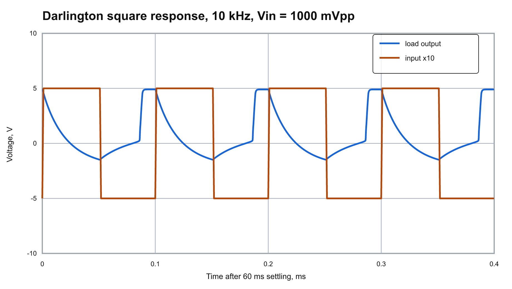

# 004 RadioStorage shema-1804-6 Upper Darlington Variant

This folder is derived from `003_radiostorage_shema_1804_6`. The circuit keeps the bootstrap voltage-addition network and adds an extra NPN transistor in the upper output arm, so `VT2A` and `VT2B` work as a Darlington emitter follower.

Source image:

`https://radiostorage.net/uploads/Image/schemes/18/shema-1804-6.png`

## GitHub Preview

### Source Image



### Reconstructed Schematic



### Simulation Plots















## Circuit Changes Compared With 003

- `VT2A`: added KT3102A NPN Darlington driver, `Bf = 100`.
- `VT2B`: existing KT817A NPN upper power transistor, `Bf = 50`.
- `VD3`: added KD521A diode in the bias chain so the upper Darlington pair has an extra base-emitter drop available.
- `VT3`: lower KT816A PNP emitter follower, unchanged.
- `R1A`, `R1B`, `R2`, `R3`, `R4`, `C2`, and `C4`: kept from the 003 bootstrap run for a direct comparison.

## ngspice Check

The Darlington model converged in ngspice.

Operating point from `data/darlington/ngspice.log`:

- `V(b_in)`: about 0.891 V
- `V(e_vt1)`: about 0.231 V
- `V(drive)`: about 5.490 V
- `V(b_top)`: about 7.446 V
- `V(b_upper)`: about 6.835 V
- `V(out)`: about 6.160 V before output capacitor
- `V(load)`: about 0.000 V DC after output capacitor
- VT2A collector current: about 0.36 mA
- VT2B collector current: about 18.63 mA
- VT3 collector current: about 18.53 mA
- Total supply current in this simplified transistor model: about 20.92 mA

## THD Sweeps

The THD-vs-frequency graph now has separate target-power curves at 20 mW, 50 mW, 100 mW. Each point retunes the input amplitude toward the requested output power before estimating harmonics 2-5 from transient data.

At 1 kHz and the 100 mW target, the simulated point is:

- Output power: `107.50 mW`
- Load RMS voltage: `0.927 V`
- Input swing: `179.7 mVpp`
- THD estimate: `73.850 %`

The THD-vs-output-power graph now includes 100 Hz, 500 Hz, 1 kHz, 5 kHz, 10 kHz. The largest simulated power-sweep point is about `1704.35 mW` into 8 ohm with `45.06 %` THD.

## Non-Clipping Check

- Sine input swing: `1.0000 Vpp`.
- Output node before C2: `5.1544..11.7244 V`.
- Rail headroom at that node: at least `0.2756 V`.
- Speaker/load swing after C2: `6.6022 Vpp`.

## Square-Wave Response

- 1 kHz: load swing about `7.163 Vpp`.
- 10 kHz: load swing about `6.392 Vpp`.

## Reusable Runner

Run the complete regeneration flow from the repository root with:

```powershell
python scripts\run_circuit_result.py results\004_radiostorage_shema_1804_6_darlington\variants\darlington.py
```

## Files

- `source/shema-1804-6.png`: original downloaded image.
- `variants/darlington.py`: reusable circuit variant with schematic drawing, SPICE netlists, measurements, and result description.
- `schematic/reconstructed_amplifier_darlington.svg/png`: redrawn Darlington schematic.
- `netlists/radiostorage_amp_darlington.cir`: main ngspice netlist.
- `data/darlington/ac_response.csv`: AC gain/phase data from ngspice.
- `data/darlington/transient_1khz.csv`: 1 kHz transient data from ngspice.
- `data/darlington/frequency_sweep.csv`: fixed-output-power frequency sweep with THD estimates.
- `data/darlington/power_sweep.csv`: multi-frequency input-level sweep with THD versus output power.
- `data/darlington/square/*.csv`: 1 kHz and 10 kHz square-wave transient data.
- `plots/darlington_*.svg/png`: generated plots for the Darlington variant.
