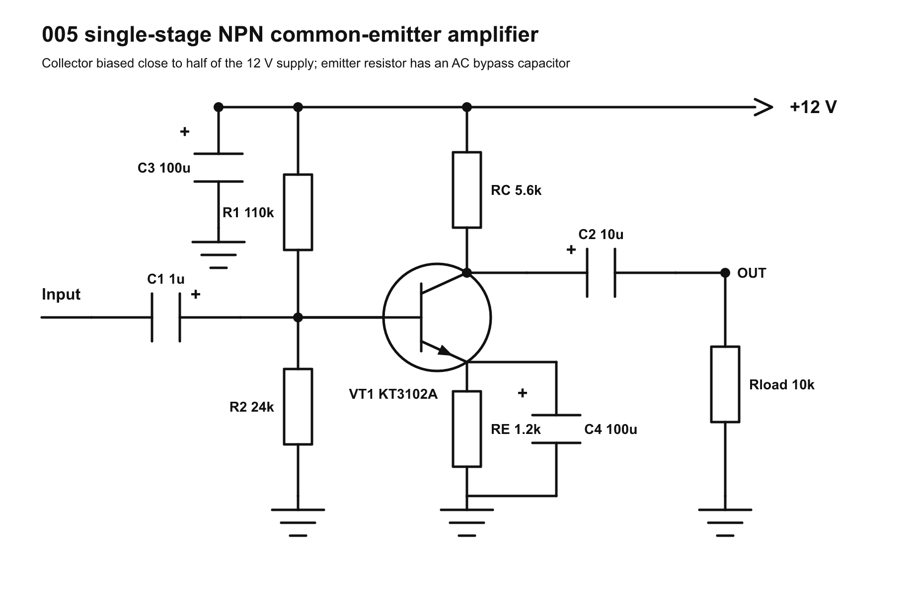
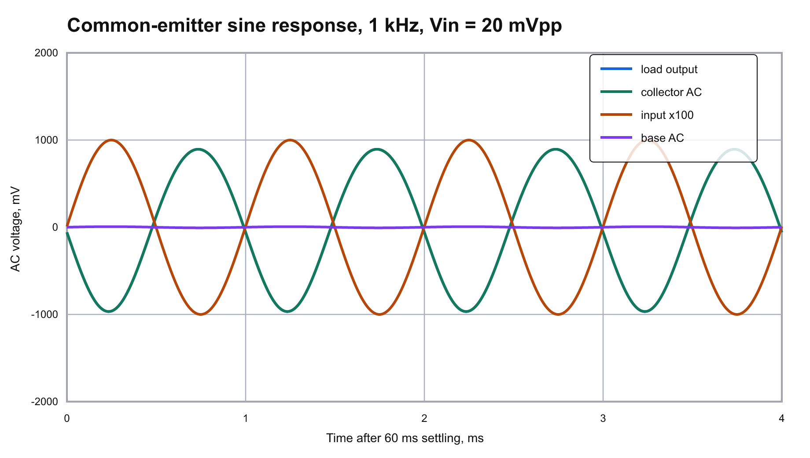
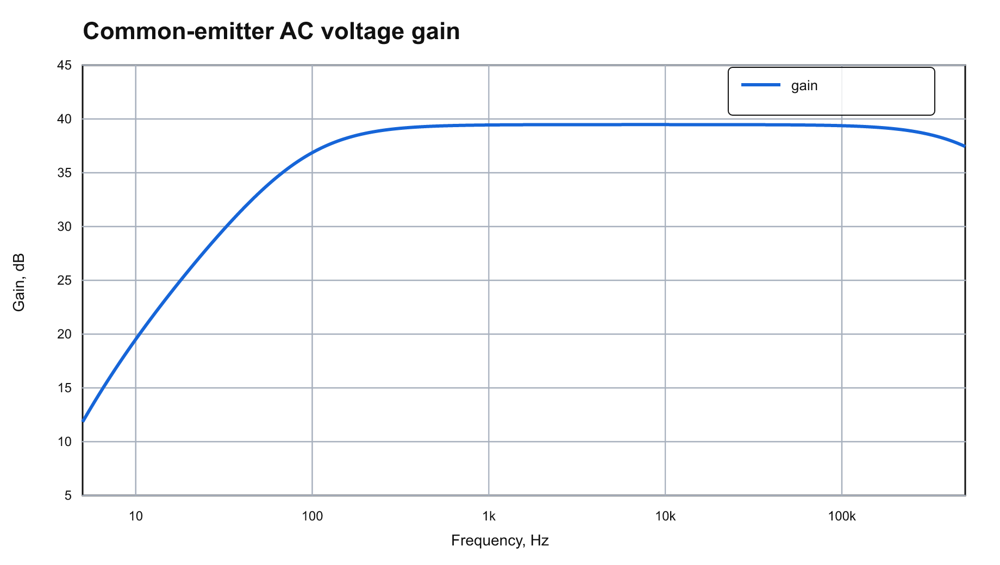

# 005 single-stage NPN common-emitter amplifier

This result is a simple one-transistor common-emitter voltage amplifier.  The circuit uses a KT3102A-like NPN model, a base divider, an emitter resistor for DC stability, an emitter bypass capacitor for higher AC gain, and input/output coupling capacitors.

The main design target was to bias the collector near half of the 12 V supply so the collector can swing in both directions before clipping.  The chosen E24 values are:

- `R1`: 110k from +12 V to base
- `R2`: 24k from base to ground
- `RC`: 5.6k collector resistor
- `RE`: 1.2k emitter resistor
- `Rload`: 10k
- `C1`: 1u input coupling
- `C2`: 10u output coupling
- `C3`: 100u supply bypass
- `C4`: 100u emitter bypass, positive terminal toward the emitter

## Operating point

ngspice DC operating point:

- Base voltage: `1.938 V`
- Emitter voltage: `1.298 V`
- Collector voltage: `6.002 V`
- Collector current: `1.072 mA`
- Total supply current in this small-signal model: `1.163 mA`

## Simulation

At 1 kHz with `20 mVpp` input:

- Transient voltage gain: `93.17 V/V`
- AC gain at 1 kHz: `39.44 dB`
- Output RMS voltage: `658.71 mV`

## Files

- `variants/common_emitter.py`: reusable circuit variant with schematic drawing, SPICE netlist, plots, and README generation.
- `schematic/common_emitter_amplifier.svg/png`: generated schematic.
- `netlists/common_emitter_amp.cir`: main ngspice netlist.
- `data/ngspice.log`: operating point and ngspice run log.
- `data/ac_response.csv`: AC gain/phase data.
- `data/transient_1khz.csv`: 1 kHz transient data.
- `data/summary.csv`: compact numeric summary.
