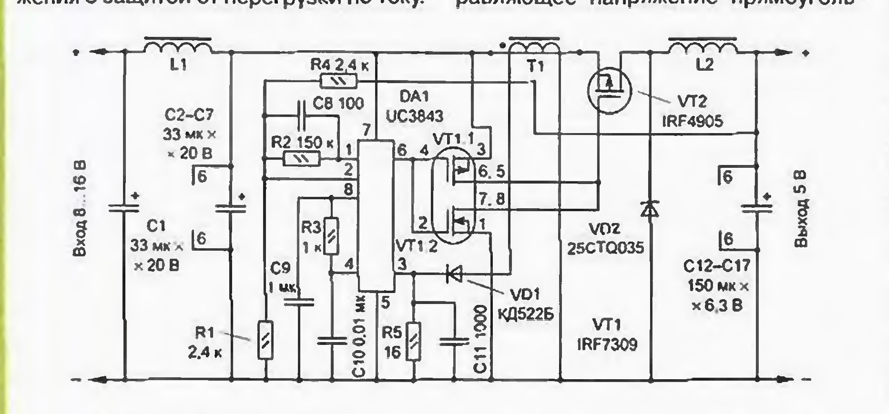
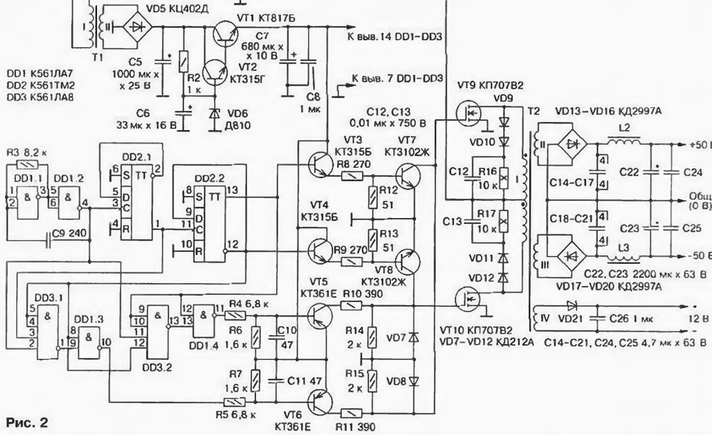
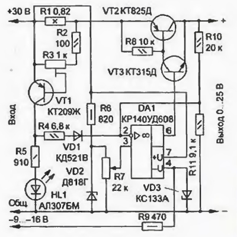

# Radio 2000 power-supply page study

This folder contains a small study run for finding switched-mode power-supply schematics in Radio magazine pages from 2000.

## Search method

- Used the December 2000 annual contents page first, instead of downloading the whole year in parallel.
- Kept downloads selective and sequential to avoid creating heavy traffic for archive.radio.ru.
- Ran the project OpenCV layout detector and the separate frequency/histogram hint layer on the candidate pages.
- Saved layout previews, frequency previews, extracted blocks, and the most useful schematic crops locally.

## Useful annual contents hits

| Candidate | Contents entry | Source pages | Result |
|---|---|---|---|
| Best compact candidate | "Импульсный стабилизатор напряжения с повышенным КПД", А. Миронов | [2000-11-043](https://archive.radio.ru/web/2000/11/043), [2000-11-044](https://archive.radio.ru/web/2000/11/044) | Compact UC3843-based switching regulator. Good study target. |
| Powerful SMPS candidate | "Импульсный блок питания мощного УМЗЧ", А. Колганов | [2000-02-035](https://archive.radio.ru/web/2000/02/035), [2000-02-036](https://archive.radio.ru/web/2000/02/036) | Larger 800 W SMPS for an audio power amplifier. Useful but less simple. |
| Flyback PSU candidate | "Обратноходовый импульсный ИП", В. Косенко, С. Косенко, В. Федоров | [2000-01-041](https://archive.radio.ru/web/2000/01/041), [2000-01-042](https://archive.radio.ru/web/2000/01/042) | Continuation from Radio 1999 No. 12; useful for setup waveforms and nearby simple supply material. |

## Best schematic found

The most suitable "simple switched-mode power supply" training example in this pass is the UC3843-based high-efficiency switching regulator from Radio No. 11, 2000, page 44.

The OpenCV detector found the schematic as a single block with confidence 0.87, while the frequency layer also marked the same area as line-art/schematic. The frequency layer still over-marks some large headings as schematic-like because bold title text has strong horizontal/vertical periodicity, so this page is useful for future tuning.

## Additional candidates

This is the main schematic from the audio-amplifier SMPS article. It is a good power-supply example, but it is too complex to be the first "simple" training target.

This simple stabilizer was found on the continuation page near the flyback power-supply article. It is compact and clean, but it is not the best match for a switched-mode supply search.

## Generated analysis files

- `layout/` contains OpenCV block JSON, cropped blocks, and annotated page previews.
- `frequency/` contains the independent frequency/histogram hint JSON and annotated previews.
- `candidates/` contains selected schematic crops and the best annotated page layout copy.
